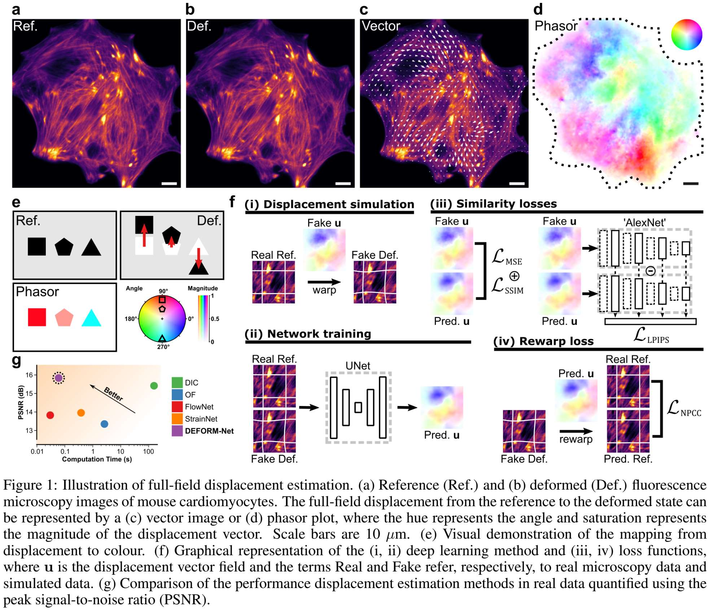

# DEFORM-Net (Displacement Estimation FOR Microscopy)

## Publication

**Estimating full-field displacement in biological images using deep learning**   
*Solomon J. E. T. Warsop, Soraya Caixeiro, Marcus Bischoff, Jochen Kursawe, Graham D. Bruce, and Philip Wijesinghe*  
2024 (BIORXIV/595161) [https://doi.org/10.1101/2024.05.21.595161](https://doi.org/10.1101/2024.05.21.595161)

## Abstract

The estimation of full-field displacement between biological image frames or in videos is important for quantitative analyses of motion, dynamics and biophysics.
However, the often weak signals, poor biological contrast and many noise processes typical to microscopy make this a formidable challenge for many contemporary methods.
Here, we present a deep-learning method, termed Displacement Estimation FOR Microscopy (DEFORM-Net), that outperforms traditional digital image correlation and optical flow methods, as well as recent learned approaches, offering simultaneous high accuracy, spatial sampling and speed.
DEFORM-Net is experimentally unsupervised, relying on displacement simulation based on a random fractal Perlin-noise process and optimised training loss functions, without the need for experimental ground truth.
We demonstrate its performance on real biological videos of beating neonatal mouse cardiomyocytes and pulsed contractions in _Drosophila_ pupae, and in various microscopy modalities.
We provide DEFORM-Net as open source, including inference in the ImageJ/FIJI platform, for rapid evaluation, which will empower new quantitative applications in biology and medicine.

<p align="center">

</p>

## Description

This repository contains the source code for training and inference with DEFORM-Net.

The associated data, compiled code and trained models can be found in our institutional repository [https://doi.org/10.17630/feab7fa3-d77b-46e8-a487-7b47c760996a]

The example scripts in the root directory rely on the minimal example data provided in the above link placed in the ```C:/example/``` directory.

Please refer to the [Supplementary Information](https://www.biorxiv.org/content/10.1101/2024.05.21.595161v1.supplementary-material) for Software Documentation.


## Usage

### ImageJ/FIJI

DEFORM-Net can be run using FIJI/ImageJ using [deepImageJ](https://deepimagej.github.io/) and our pre-trained [torchscript models](https://doi.org/10.17630/feab7fa3-d77b-46e8-a487-7b47c760996a).
The ```ImageJ_Stack_Macro.ijm``` macro can be used to run deformnet on a stack/image sequence/video.
The outputs will be the x and y components of the displacement field as separate image stacks.

### Command-line tools

DEFORM-Net can be run programmatically using python (or the compiled binaries) using ```deformnet_inference.py```:

```python deformnet_inference.py "path_to_model" "path_to_data"```

with optional arguments: 

```
-- suffix SUFFIX           suffix to append to inference outputs (output will be in folders 'Dispx-<suffix>'
-- crop CROP               size to crop data to
-- overwrite OVERWRITE     overwrite output if it exists
-- save_fmt SAVE_FMT       save format : 'npy', 'tiff', or 'both'
```

### Training

New models may be trained using the modules in this repository.
Please see the [Supplementary Information](https://www.biorxiv.org/content/10.1101/2024.05.21.595161v1.supplementary-material) for more detailed documentation.


## Code listing

- `deformnet_inference.py` : command-line interface to DEFORM-Net inference
- `deformnet_inference_script.py` : script for DEFORM-Net inference
- `deformnet_prepare_data.py` : script to generate training data from real microscopy images
- `deformnet_train_model.py` : script to train a model based on a config.yml file (see `/configs/config_example.yml`)
- `deformnet_visualise_displacements.py` : script to convert output displacement fields to vector and phasor images
- `ImageJ_Stack_Macro.ijm` : ImageJ/FIJI macro for inference of an image stack using deepImageJ and DEFORM-Net models

## Changelog

- 20240517 Initial Commit
